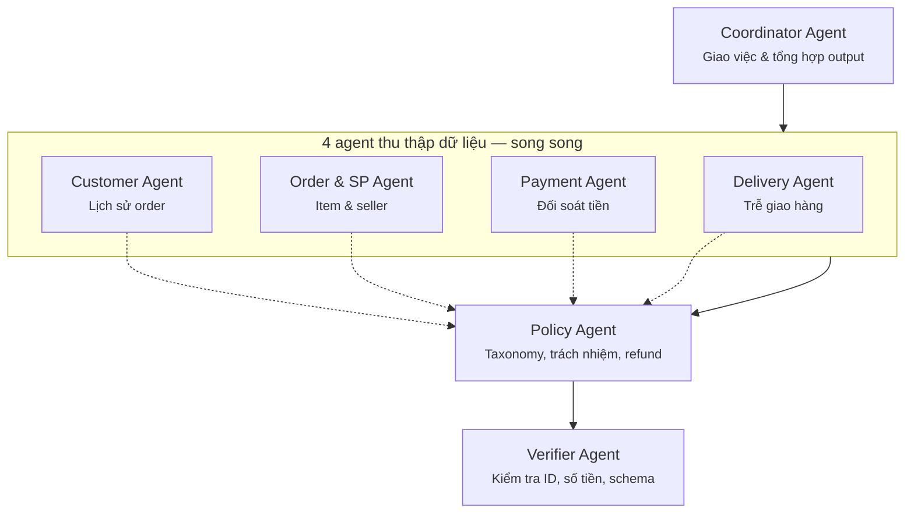
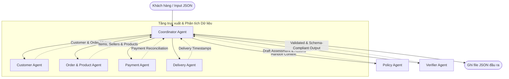

<<<<<<< HEAD
# Kiến trúc Hệ thống Multi-Agent Giải quyết Khiếu nại (E-commerce Dispute Resolution)

Hệ thống được thiết kế theo mô hình Multi-Agent với sự phân chia nhiệm vụ rõ ràng, đảm bảo quy trình kiểm chứng chéo (handoff) để giải quyết khiếu nại thương mại điện tử chính xác nhất.

## 1. Sơ đồ Kiến trúc Tổng quan (Mermaid)

## 2. Vai trò và Quyền truy cập của từng Agent

### 2.1 Coordinator Agent
- **Vai trò**: Điểm bắt đầu (entry point) của hệ thống. Nhận `order_id` và thông tin claim, sau đó phân chia công việc cho 4 data agents, chờ tổng hợp kết quả, sau đó đưa cho Policy Agent và Verifier Agent.
- **Handoff**: Điều phối luồng xử lý đồng thời (parallel processing) bằng `ThreadPoolExecutor` để tối ưu tốc độ.

### 2.2 Các Agent Thu thập dữ liệu (Chạy song song)
- **Customer Agent**: Truy vấn lịch sử khách hàng để xác định họ có phải là khách hàng cũ (repeat customer) hay không, đồng thời trích xuất danh sách các order liên quan.
- **Order & SP Agent**: Quét danh sách mặt hàng, tính số lượng sản phẩm, xác định danh sách các nhà bán (sellers) và ngành hàng (categories).
- **Payment Agent**: Tổng hợp toàn bộ các dòng thanh toán, đối chiếu với tổng (item + freight) để xác định xem thanh toán có khớp (reconciled) và có chia nhỏ (split payment) hay không.
- **Delivery Agent**: Tính toán độ trễ giao hàng (delivery variance) và độ trễ bàn giao của từng nhà bán (seller handoff variance) để xác định xem ai đã giao hàng trễ.

### 2.3 Policy Agent
- **Vai trò**: Hoạt động như Thẩm phán dựa trên luật `EC_POLICY_V2`. Nhận vào toàn bộ evidence từ 4 agent trên, dùng LLM để suy luận:
  - **Taxonomy (Vấn đề chính/phụ)**
  - **Trách nhiệm (Responsible Parties)**
  - **Hoàn tiền đề xuất (Refund Amount)**
  - **Hướng giải quyết (Resolution Actions)**

### 2.4 Verifier Agent
- **Vai trò**: Hoạt động như Kiểm toán viên trước khi xuất file. 
- **Quyền hạn**: Kiểm tra giới hạn số lượng các phần tử mảng (ví dụ: tối đa 5 item, 3 seller), chuẩn hóa số tiền thành 2 chữ số thập phân, gán `null` đúng quy định, và lọc ra các `evidence_ids` tránh False Positive. Không tham gia quyết định logic nghiệp vụ, chỉ chặn lỗi schema/hard gate.
=======
# Multi-Agent Dispute Resolution System Architecture

Hệ thống được thiết kế theo mô hình **Multi-Agent** phối hợp, trong đó mỗi Agent tập trung vào một domain nghiệp vụ cụ thể. Việc phối hợp và đối soát dữ liệu giúp xử lý chính xác 50 khiếu nại khách hàng trên tập dữ liệu Olist.

## 1. Sơ đồ phối hợp giữa các Agent

## 2. Vai trò và Quyền truy cập dữ liệu của từng Agent

| Agent Name | Vai trò nghiệp vụ | Dữ liệu truy cập (Olist Dataset) |
| :--- | :--- | :--- |
| **Coordinator Agent** | Nhận case đầu vào, điều phối các Agent nhánh, tổng hợp kết quả nghiệp vụ, gọi Verifier và ghi file output. | Điều phối chung |
| **Customer Agent** | Định danh khách hàng (`customer_unique_id`), tra cứu lịch sử mua hàng, xác định khách hàng thân thiết (`repeat_customer`). | `olist_customers_dataset`, `olist_orders_dataset` |
| **Order & Product Agent** | Phân tích chi tiết các item trong đơn hàng, thông tin seller, sản phẩm, dịch tên danh mục sang tiếng Anh, tính hạn bàn giao. | `olist_order_items_dataset`, `olist_products_dataset`, `product_category_name_translation` |
| **Payment Agent** | Đối soát số tiền thanh toán thực tế với tổng giá trị đơn hàng (price + freight) trong sai số cho phép (0.10 BRL). | `olist_order_payments_dataset`, `olist_order_items_dataset` |
| **Delivery Agent** | Phân tích các mốc thời gian giao nhận thực tế so với thời gian dự kiến để phát hiện giao hàng muộn. | `olist_orders_dataset` |
| **Policy Agent** | Áp dụng quy tắc nghiệp vụ `EC_POLICY_V2` để đưa ra Primary Issue, Secondary Issues, tiền hoàn trả và Actions. | Không trực tiếp truy cập DB, nhận context từ Coordinator |
| **Verifier Agent** | Đảm bảo tính tuân thủ của schema đầu ra, thực thi các giới hạn mảng (Limits) và tự động chuẩn hoá định dạng ID bằng chứng. | Nhận context đầu ra đã tổng hợp |

## 3. Luồng hoạt động (Handoff Flow)

1. **Nhận Case**: `CoordinatorAgent` nhận thông tin khiếu nại (chứa `claimed_order_id`).
2. **Thu thập dữ liệu song song**:
   - `CustomerAgent` tìm kiếm lịch sử các đơn hàng khác của khách hàng đó.
   - `OrderProductAgent` lấy danh sách sản phẩm, sellers, và kiểm tra thời hạn bàn giao (`shipping_limit_date`).
   - `PaymentAgent` cộng tổng tất cả các phương thức thanh toán và kiểm tra xem có khớp với tổng hóa đơn không.
   - `DeliveryAgent` tính toán khoảng thời gian trễ của hãng vận chuyển.
3. **Phân tích chính sách**: `CoordinatorAgent` bàn giao toàn bộ context thu thập được từ các Agent nhánh cho `PolicyAgent`. `PolicyAgent` áp dụng các rule nghiệp vụ ưu tiên cao nhất trước và trả về quyết định hoàn tiền, hành động xử lý tiếp theo.
4. **Kiểm duyệt đầu ra**: `CoordinatorAgent` đóng gói output sơ bộ và chuyển cho `VerifierAgent` để tự động kiểm duyệt schema, lọc bớt phần tử vượt giới hạn và sinh tập `evidence_ids`.
5. **Ghi kết quả**: Ghi file kết quả `EC_XXX.json` và cập nhật file log `trace.jsonl` và `metadata.json`.
>>>>>>> origin/main
