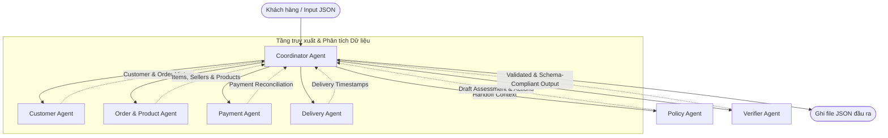

# Multi-Agent Dispute Resolution System Architecture

Hệ thống được thiết kế theo mô hình **Multi-Agent** phối hợp, trong đó mỗi Agent tập trung vào một domain nghiệp vụ cụ thể. Việc phối hợp và đối soát dữ liệu giúp xử lý chính xác 50 khiếu nại khách hàng trên tập dữ liệu Olist.

## 1. Sơ đồ phối hợp giữa các Agent

## 2. Vai trò và Quyền truy cập dữ liệu của từng Agent

| Agent Name | Vai trò nghiệp vụ | Dữ liệu truy cập (Olist Dataset) |
| :--- | :--- | :--- |
| **Coordinator Agent** | Nhận case đầu vào, điều phối các Agent nhánh, tổng hợp kết quả nghiệp vụ, gọi Verifier và ghi file output. | Điều phối chung |
| **Customer Agent** | Định danh khách hàng (`customer_unique_id`), tra cứu lịch sử mua hàng, xác định khách hàng thân thiết (`repeat_customer`), tóm tắt khiếu nại bằng LLM. | `olist_customers_dataset`, `olist_orders_dataset` |
| **Order & Product Agent** | Phân tích chi tiết các item trong đơn hàng, thông tin seller, sản phẩm, dịch tên danh mục sang tiếng Anh, tính hạn bàn giao (`shipping_limit_date`) và xác định seller bàn giao muộn. | `olist_order_items_dataset`, `olist_products_dataset`, `product_category_name_translation` |
| **Payment Agent** | Đối soát số tiền thanh toán thực tế với tổng giá trị đơn hàng (price + freight) trong sai số cho phép (0.10 BRL). | `olist_order_payments_dataset`, `olist_order_items_dataset` |
| **Delivery Agent** | Phân tích các mốc thời gian giao nhận thực tế so với thời gian dự kiến để phát hiện giao hàng muộn. | `olist_orders_dataset` |
| **Policy Agent** | Áp dụng quy tắc nghiệp vụ `EC_POLICY_V2` để đưa ra Primary Issue, Secondary Issues, tiền hoàn trả và Actions. Rule engine là nguồn quyết định cuối cùng; LLM đóng vai trò đề xuất (advisory) được so khớp với quy tắc để điều chỉnh confidence, tránh bịa sự kiện. | Không trực tiếp truy cập DB, nhận context từ Coordinator |
| **Verifier Agent** | Đảm bảo tính tuân thủ của schema đầu ra, thực thi các giới hạn mảng (Limits), tự động sinh `evidence_ids` chuẩn từ dữ liệu thật, clamp confidence và null handling. | Nhận context đầu ra đã tổng hợp |

## 3. Luồng hoạt động (Handoff Flow)

1. **Nhận Case**: `CoordinatorAgent` nhận thông tin khiếu nại (chứa `claimed_order_id`).
2. **Thu thập dữ liệu song song**:
   - `CustomerAgent` tìm kiếm lịch sử các đơn hàng khác của khách hàng đó.
   - `OrderProductAgent` lấy danh sách sản phẩm, sellers, và kiểm tra thời hạn bàn giao (`shipping_limit_date`).
   - `PaymentAgent` cộng tổng tất cả các phương thức thanh toán và kiểm tra xem có khớp với tổng hóa đơn không.
   - `DeliveryAgent` tính toán khoảng thời gian trễ của hãng vận chuyển.
3. **Phân tích chính sách**: `CoordinatorAgent` bàn giao toàn bộ context thu thập được từ các Agent nhánh cho `PolicyAgent`. `PolicyAgent` áp dụng các rule nghiệp vụ ưu tiên cao nhất trước (order status -> delivery -> payment) và trả về quyết định hoàn tiền, hành động xử lý tiếp theo. LLM được gọi để đề xuất verdict, kết quả so khớp với rule engine để cộng confidence khi đồng thuận.
4. **Kiểm duyệt đầu ra**: `CoordinatorAgent` đóng gói output sơ bộ và chuyển cho `VerifierAgent` để tự động kiểm duyệt schema, lọc bớt phần tử vượt giới hạn, sinh tập `evidence_ids` hợp lệ (chỉ ID dựng được từ CSV) và chuẩn hoá null/rounding.
5. **Ghi kết quả**: Ghi file kết quả `EC_XXX.json` và cập nhật file log `trace.jsonl` và `metadata.json`.

## 4. Công nghệ

- **Model**: `qwen/qwen3-8b` (8B parameters, <= 10B theo yêu cầu) qua OpenRouter.
- **Framework**: Python thuần (pandas, requests) - Custom Multi-Agent Framework.
- **Kiểm chứng**: `validate_outputs.py` chạy hard-gate check (schema, limits, evidence, null handling, rounding) trên toàn bộ 50 output sau mỗi lần chạy.
